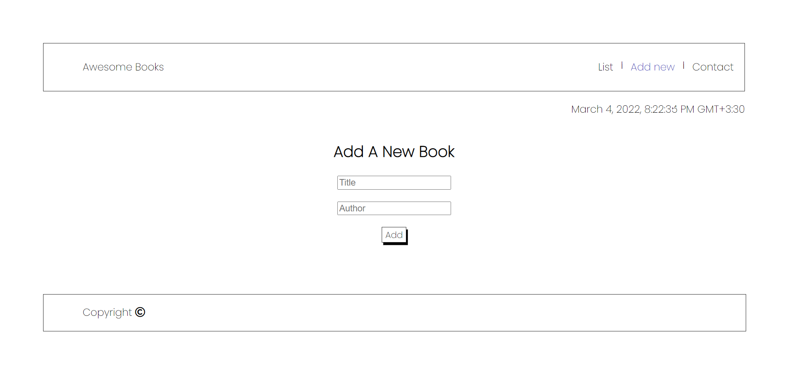

# ES6-Awesome-book

# Portfolio

> Book list, Add book, Remove book, navigation bar, OnePage tech

## Live Demo

[Live Demo Link](https://beyk.github.io/Awesome-book-es6/)

## Built With

- HTML
- CSS
- Javascript
- VSCode
- Linters

## Authors

👤 **Beyk**

- GitHub: [@Beyk](https://github.com/beyk)
- LinkedIn: [LinkedIn](https://www.linkedin.com/in/asghar-beykmohammadi-1b16b291/)
- Twitter: [@Beyk_a](https://twitter.com/beyk_a)

## 🤝 Contributing

Contributions, issues, and feature requests are welcome!

Feel free to check the [issues page](#).

## Show your support

Give a ⭐️ if you like this project!

## 📝 License

This project is [MIT](./LICENSE) licensed.

